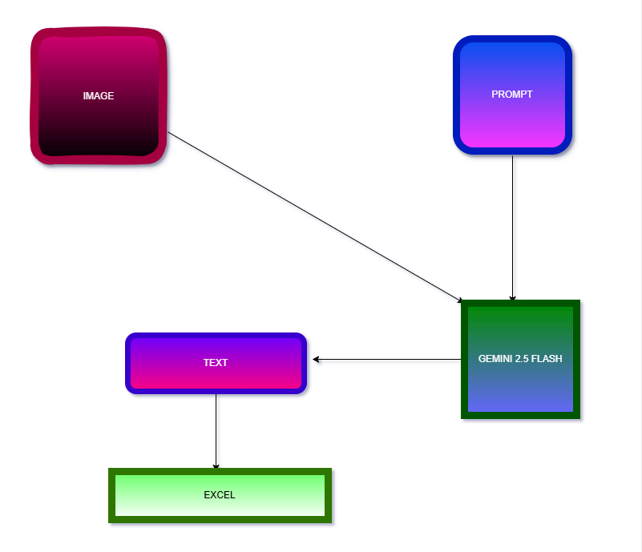

# Data Extraction from Image using Gemini 2.5 API

<h1>Data Extraction From Images using AI</h1>

## <h3>Introduction<h3>

In today’s data-driven world, extracting meaningful information from unstructured visual content like scanned documents, receipts, and forms is a growing challenge. Manual data entry is time-consuming, error-prone, and inefficient. This project introduces an intelligent automation pipeline that leverages the capabilities of Gemini 2.5 Flash, a powerful multimodal AI model, to extract data from images using prompt-based guidance and convert it into structured Excel format.

By combining image processing with natural language prompts, this system enables dynamic and flexible extraction of targeted information. Whether it's a table, invoice, or handwritten note, users can guide the model using custom instructions, and the system intelligently returns clean, context-aware text ready for export. This solution enhances speed, accuracy, and scalability for real-world document processing tasks.

## <h3>🟨🟨 IMAGE (Input Source)<h3>

   Purpose: Serves as the raw visual input.

What It Contains: This could be any visual format such as scanned documents, invoices, receipts, forms, or handwritten notes.
Role in Workflow: It is the primary source of unstructured data. It may contain tabular data, numbers, text, or other information of interest that needs to be extracted.

---

## <h3>🟨🟦🔷 2. PROMPT (User Instruction)<h3>

Purpose: Provides specific guidance or questions related to the image.
What It Might Contain: Instructions like:
“Extract invoice number and date.”
“Find all email addresses in this image.”
“Summarize this document.”
Role in Workflow: Acts as a filter or lens that tells the AI model (Gemini 2.5 Flash) what to look for and how to interpret the image.

<h3>🟨🟩 3. GEMINI 2.5 FLASH (AI Engine)></h2>

Purpose: The core processing engine powered by multimodal AI (text + image input).

Key Functions:

Image Processing: Uses OCR (Optical Character Recognition) to read and understand text in the image.
Prompt Processing: Understands the user’s prompt and applies contextual understanding.
Fusion: Combines insights from the image and the prompt to generate meaningful output.
Output: Clean, structured TEXT extracted from the image based on the prompt. 

<h2>🟨🟪 4. TEXT (Intermediary Output)</h2>

Purpose: Contains the clean, refined textual output generated by Gemini 2.5 Flash.
Nature of Text:
It may be summarized text, extracted fields (like dates, names, numbers), or structured sections.
Why It Matters: This is the refined data that will be used for export, storage, or further analysis.

<h2> 🟨🟩 5. EXCEL (Final Output Format)</h2>

Purpose: To store and organize the text output in a tabular/spreadsheet format.
Benefits:
Easy to analyze, visualize, or share.
Can be used for further processing (e.g., sorting, filtering, report generation).
Common Use Cases: Data logs, report generation, business intelligence, record-keeping.

<h2>🟨🟨✅ Conclusion </h2>

This project creates an intelligent pipeline that extracts meaningful data from unstructured images by combining:
Visual input (IMAGE),
Instructional guidance (PROMPT),
and AI-based fusion and processing (GEMINI 2.5 FLASH).
The end result is clean, actionable TEXT, which is then exported to Excel for structured usage.
This system enhances productivity, reduces manual data entry, and provides a scalable solution for document automation tasks.

